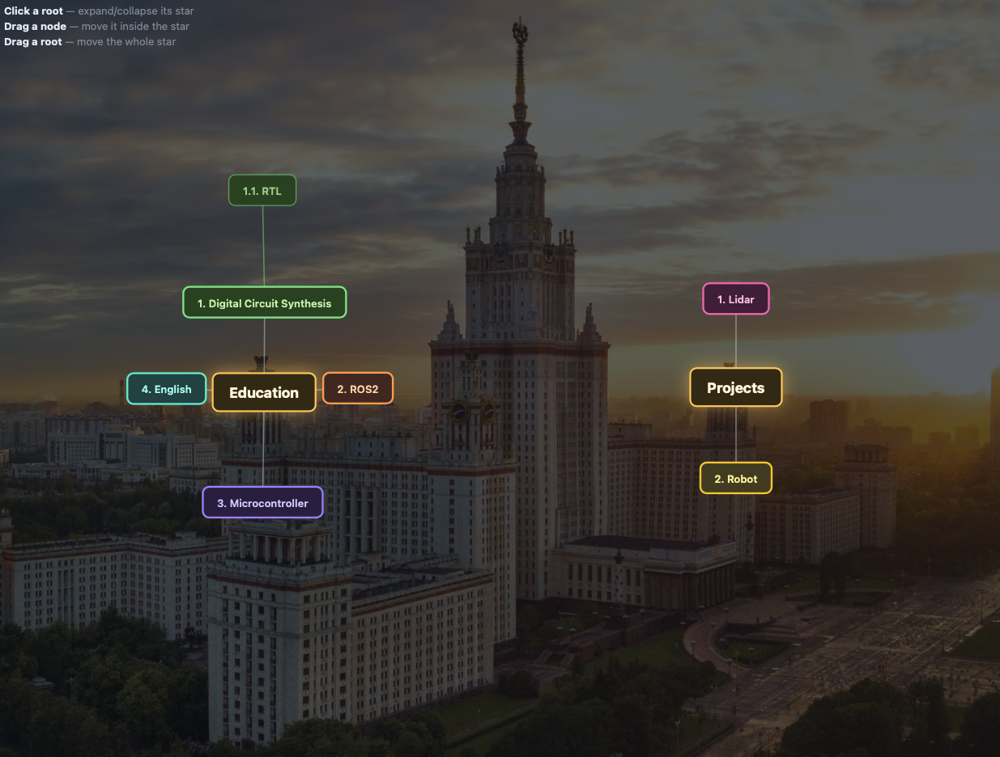

# Task Tree

An interactive visualization of a task tree as **radial (star) graphs**.

Root nodes (sections like `Education`, `Project`, or top-level numbered tasks) are shown on the canvas. Clicking a root **expands a radial star** — its descendants spread across concentric rings. Nodes can be dragged; they repel and attract each other without overlapping. Clicking the root again collapses the star.



---

## Features

- **Tree source** — tasks are defined in a plain text file with the hierarchy `1 → 1.1 → 1.1.1`.
- **Root nodes** — unnumbered lines (`Education`, `Project`) become section roots.
- **Expandable stars** — clicking a root reveals its subtree radially across rings.
- **Collapse** — clicking the root again hides the star.
- **Per-branch colors** — each top-level numbered node (`1.`, `2.`, `3.`) gets its own color; descendants inherit the hue. Sections share a common gray.
- **Dragging** — nodes move inside their star; the root moves the whole star.
- **Physics** — a simulation with springs to targets, repulsion on overlap, and soft edge springs. No overlapping.
- **Automatic root spacing** — when one star expands, neighboring roots slide aside so they don't collide.
- **Window fitting** — font and radii recompute on `resize`; the graph always fits the window.
- **Background** — a dimmed `source/msu.jpg` image sits behind the graph (optional).

---

## Quick start

```bash
python graph_task.py